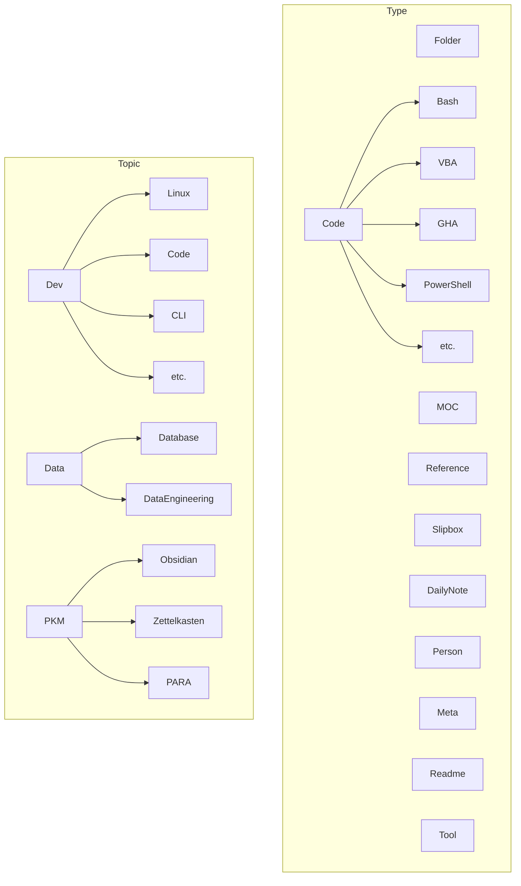

# ABOUT

> About this vault.

[TOC]

## Overview

This vault is a template vault serving the purpose of housing my commonly used settings for [Obsidian](https://obsidian.md).

## Setup

The setup has four main components:

- Settings, Configuration, and Plugins
- Folder Structure
- Tag Structure
- Content

### Settings, Configuration, and Plugins

Settings for any Obsidian Vault are (by default) housed under the `.obsidian` vault root-level directory.

```bash
├───.obsidian
│   ├───plugins
│   └───themes
|───app.json
│───appearance.json
│───backlink.json
│───command-palette.json
│───community-plugins.json
│───core-plugins.json
│───daily-notes.json
│───graph.json
│───hotkeys.json
│───templates.json
│───workspace
│───workspaces.json
```

#### Settings

| Setting Area | Setting Name | Setting Value | Comment |
| :------------: | :------------: | :-------------: | :-------: |
|              |               |         |   |

### Folder Structure

Based off of [[Tiago Forte]]'s [[PARA Method]].

<details><summary>View Vault Folder Structure:</summary>

```bash
├───.obsidian
│   ├───plugins
│   └───themes
├───0-INBOX
├───1-SLIPBOX
├───2-AREAS
│   ├───Code
│   │   ├───AutoHotKey
│   │   ├───Bash
│   │   ├───Batch
│   │   ├───Cmd
│   │   ├───CSS
│   │   ├───Espanso
│   │   ├───GitHub Actions
│   │   ├───Java
│   │   ├───JavaScript
│   │   ├───Pandoc
│   │   ├───PowerQuery
│   │   ├───PowerShell
│   │   ├───Python
│   │   ├───R
│   │   ├───Registry
│   │   ├───Run
│   │   ├───SQL
│   │   ├───VBA
│   │   └───Visual Basic
│   ├───Daily-Notes
│   │   ├───2021
│   │   │   ├───2021-11
│   │   │   └───2021-12
│   │   └───2022
│   │       ├───2022-01
│   │       ├───2022-02
│   │       ├───2022-03
│   │       ├───2022-04
│   │       ├───2022-05
│   │       ├───2022-06
│   │       ├───2022-07
│   │       ├───2022-08
│   │       └───2022-09
│   ├───Development
│   ├───Goals
│   ├───Guides
│   ├───Learning
│   ├───Lists
│   ├───Meta
│   ├───Mindsweeps
│   ├───MOCs
│   └───People
└───3-RESOURCES
    └───Templates
        ├───Code Templates
        ├───Core Templates
        └───Fragments
```
	
</details>

### Tag Structure

Tags are split into **Type** and **Topic** prefixed tags:



### Content

Content in this vault is limited and includes primarily technical/development related knowledge.

***

## Appendix: Links and References

***

Jimmy Briggs <jimmy.briggs@jimbrig.com> | 2022