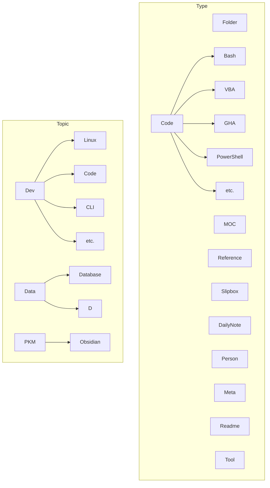

# ABOUT

> About this vault.

[TOC]

## Overview

This vault is a template vault serving the purpose of housing my commonly used settings for [Obsidian](https://obsidian.md).

## Setup

The setup has four main components:

- Settings, Configuration, and Plugins
- Folder Structure
- Tag Structure
- Content

### Settings, Configuration, and Plugins

### Folder Structure

Based off of [[Tiago Forte]]'s [[PARA Method]].

### Tag Structure

***

## Appendix: Links and References

***

Jimmy Briggs <jimmy.briggs@jimbrig.com> | 2022