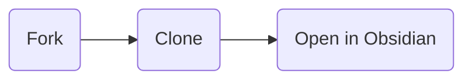

# Template Obsidian Vault

> A *template* obsidian vault with my commonly used settings and some notes on technical development.

## Contents

- [0-INBOX](0-INBOX/_README): Landing Zone for all new notes.
- [1-SLIPBOX](1-SLIPBOX/_README): Fleeting notes mirroring the original Zettelkasten's *SlipBox*.
- [2-AREAS](2-AREAS/_README): Generic areas of my life and more - builds off of Tiego Forte's PARA Method.
- [3-RESOURCES](3-RESOURCES/_README): Generic resource notes, currently only houses my Templates.

## How To Use

***

Jimmy Briggs | 2022
